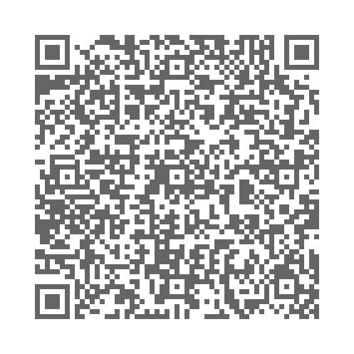

# qrv
qr code vcard howto

qrencode [https://github.com/fukuchi/libqrencode] --foreground=00000099 --background=ffffff -s 7 -m 7 -d 144 -r vcard.txt -t png -l H -o vcard.png

here the low (-l L) and the high (-l H) version

<picture>
 
</picture>

<picture>
 
</picture>
